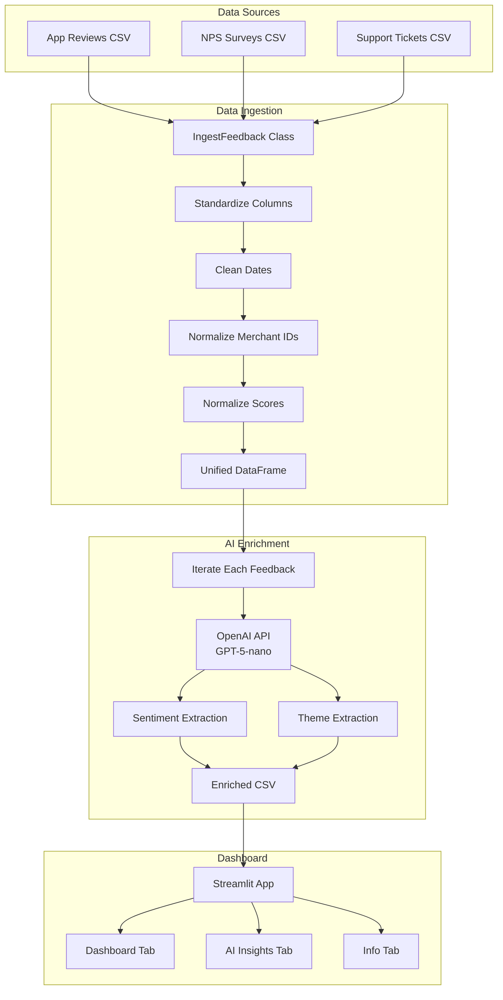

# Customer Feedback Monitoring Application

A data pipeline and dashboard for analyzing customer feedback from multiple sources, providing automated sentiment analysis, theme extraction, and AI powered merchant insights.

## Overview

This application ingests customer feedback from multiple channels (app reviews, NPS surveys, support tickets), processes and standardizes the data, applies AI powered analysis for sentiment and theme extraction, and presents actionable insights through an interactive Streamlit dashboard.

---

## Data Sources and Assumptions

### Data Sources

The pipeline processes feedback from three primary sources (AI-generated data):

1. **App Store Reviews** (`data/app_reviews.csv`)

2. **NPS Surveys** (`data/nps_surveys.csv`)

3. **Support Tickets** (`data/support_tickets.csv`)

### Key Assumptions

1. Merchant IDs are assumed to be consistent across sources after normalization (uppercase, alphanumeric only)
2. Missing scores for support tickets are acceptable 
3. Feedback themes are classified into a predefined set of categories which are assumed to capture the majority of issues that merchants report.

---

## Pipeline Architecture



---

## Automation vs. AI Decisions

### Automation (Rule-Based Processing)

**Where:**
- Column standardization and mapping
- Date format normalization
- Merchant ID cleaning (regex)
- Score normalization
- Data validation and filtering

**Reasoning:**
- Data cleaning is deterministic and needs consistent, predictable outcomes
- Processing hundreds/thousands of rows is instant, no AI latency
- No API calls required and no cost
- Logic is explicit and can be audited

### AI (LLM-Based Processing)

**Where:**
- Sentiment classification (Positive, Neutral, Negative, Frustrated)
- Theme/subject extraction (POS Performance, Payments, UX, etc.)
- Merchant feedback summaries
- Risk level assessment
- Recommended actions generation

**Reasoning:**
- Sentiment and theme analysis require interpretation. Customers can describe issues in different ways, and LLMs excel at classifying these descriptions into the predefined categories
- Summaries require natural language generation. AI can synthesize multiple feedback sources into clear and coherent summaries

**Models Used**
- **GPT-5-nano**: Used for sentiment classification and theme categorization. A smaller model provides solid accuracy while keeping latency and cost low.
- **GPT-5-mini**: Used for merchant feedback summarization. A larger model is beneficial for synthesizing multiple feedback entries and producing coherent summaries
---

## Data Quality Handling

### Problems Identified and Solutions

#### 1. Inconsistent Column Names
**Problem**: Different sources use different field names (`review_text` vs `feedback_text` vs `description`)

**Solution**: Column mapping dictionary in `standardize_columns()` method

#### 2. Date Format Variations
**Problem**: Sources use different date formats (`DD-MM-YYYY`, `YYYY-MM-DD`)

**Solution**: Source-specific date parsing, normalized to `YYYY-MM-DD`

#### 3. Merchant ID Inconsistencies
**Problem**: Varying formats, whitespace, special characters, case sensitivity

**Solution**: Normalization function with regex cleaning

#### 4. Different Rating Scales
**Problem**: App store uses 1-5 stars, NPS uses 0-10

**Solution**: Normalize all to 0-10 scale

---

## Installation

```bash
pip install -r requirements.txt
```

### Requirements
- Python 3.8+
- pandas
- openai
- pydantic
- streamlit
- plotly

### Environment Setup

Create a `.env` file or set environment variable:
```bash
OPENAI_API_KEY=your_api_key_here
```

---

## Usage

### Run Full Pipeline

```bash
python main.py
```

This will:
1. Ingest data from all sources
2. Clean and standardize
3. Apply AI enrichment
4. Save to `output_with_generated_fields.csv`

### Launch Dashboard

```bash
streamlit run streamlit_app.py
```

Access at `http://localhost:8501`

---

## Project Structure

```
lightspeed-take-home-assessment/
├── data/
│   ├── app_reviews.csv
│   ├── nps_surveys.csv
│   └── support_tickets.csv
├── src/
│   ├── ingest.py              
│   ├── llm_functions.py       
│   ├── llm_config.py          
│   └── prompts.py             
├── main.py                    
├── streamlit_app.py           
├── requirements.txt
└── README.md
```

---

